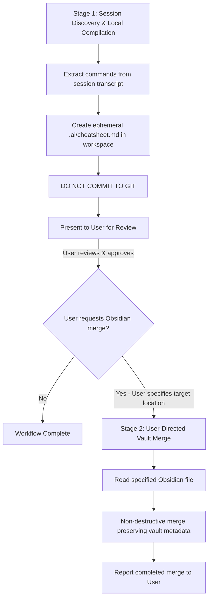

# Technical Cheatsheet & Obsidian Notes Curator

This skill defines the two-stage lifecycle, storage rules, structural invariants, and formatting standards for compiling technical cheatsheets from session activity and optionally merging them into Obsidian vaults.

## Two-Stage Workflow



### Stage 1: Ephemeral Cheatsheet Compilation (`.ai/cheatsheet.md`)

When the user asks to compile a cheatsheet or document commands used in the session:

1. **Transcript Extraction**: Inspect session logs and tool calls (`run_command`) to extract all commands executed in the current session.
2. **Deduplication & Curation**: Filter out redundant duplicate commands. Group commands by utility and isolate real-world, high-value use cases.
3. **Storage Location (`.ai/cheatsheet.md`)**: Always save the draft cheatsheet inside the `.ai/` directory at the project root (e.g., `.ai/cheatsheet.md`). Create `.ai/` if it does not exist.
4. **Git Exclusion (Strict Rule)**:
   > [!CAUTION]
   > **Do NOT commit `.ai/cheatsheet.md` to git.** This artifact is temporary by nature because every session generates its own distinct commands. Even if `.ai/` is not listed in `.gitignore`, **never** stage or commit `.ai/cheatsheet.md` or any ephemeral cheatsheet file to version control.
5. **Canonical Structure**: Apply the standard hierarchy (H2 tool name, tool summary, H3 action-oriented use cases, argument/flag descriptions, fenced code blocks).
6. **User Review**: Present `.ai/cheatsheet.md` to the user and request review. **Stop here.** Do not attempt to merge into external files or Obsidian notes without explicit direction.

### Stage 2: User-Directed Obsidian Vault Merge (Optional)

> [!IMPORTANT]
> **Vault Boundary Rule**: Files inside Obsidian vaults (such as `obsidian_cheatsheet.md` or any vault note) are **not** repository-owned by default. They live inside the user's Obsidian vault outside the Git workspace. The agent does not have access to Obsidian vault paths unless the user explicitly provides the file or its path. **Never assume a vault file exists in the Git repository or attempt to locate it automatically.**

Only proceed to Stage 2 when the user explicitly requests a merge and provides or confirms the target note location:

1. **User-Provided Target**: Wait for the user to state which file to update (e.g., via `@[obsidian_cheatsheet.md]` or an absolute path like `~/vaults/tech/cheatsheet.md`).
2. **Audit Target Content First**: Read the target vault file completely. Inspect its existing structure, metadata headers (e.g., `# Meta`, `## Resources`), custom tags, and formatting style.
3. **Preserve All Vault Context**: Never delete, truncate, or overwrite unrelated sections, personal notes, or metadata.
4. **Enrich Existing Tool Sections**: If a command from `.ai/cheatsheet.md` already exists in the target note, append the new distinct use cases under that tool's section rather than creating duplicate headers.
5. **Elevate Legacy Entries**: If older entries in the target note lack flag explanations or distinct use-case headers, bring them up to the canonical standard during the merge.
6. **Vault Reporting**: Verify the file update in the vault and report completion to the user. Do not commit vault files to project Git unless the vault itself is explicitly a Git repository.

---

## Canonical Layout & Formatting Rules

Structure commands using this layout:

```markdown
## <tool_name>
<Short 1-2 sentence description of the tool and its primary role.>

### <Action-Oriented Use Case 1 Title>
<Clear description of what the use case achieves, including explicit explanations of all flags and arguments used.>
```shell
<command line invocation>
```

### <Action-Oriented Use Case 2 Title>
<Clear description of what the use case achieves, including explicit explanations of all flags and arguments used.>
```shell
<command line invocation>
```
```

### Invariants:
1. **Outline-Friendly Headings**:
   - `## <tool_name>`: Represents the utility or subsystem (e.g. `## nmap`, `## ss - Socket Statistics`).
   - `### <Action-Oriented Title>`: Describes the concrete task (e.g. `### Discover Authoritative DHCP Servers on Local Network`). This allows Obsidian's document outline / tree view to nest each use case cleanly under its tool.
2. **Explanatory Depth**:
   - Never output a bare command snippet without explaining the arguments.
   - Weave flag explanations into the paragraph for simple commands (`using single-attempt mode (-1) and numeric output (-n)`).
   - For dense flag clusters (e.g. `ss -tulpn` or `lsof -i -P -n`), include a bulleted breakdown of every flag.
3. **Code Blocks**: Always use fenced code blocks with language identifiers (`shell`, `bash`, `powershell`).
4. **Real-World Provenance**: Only include commands that were actually tested or executed in the session.
